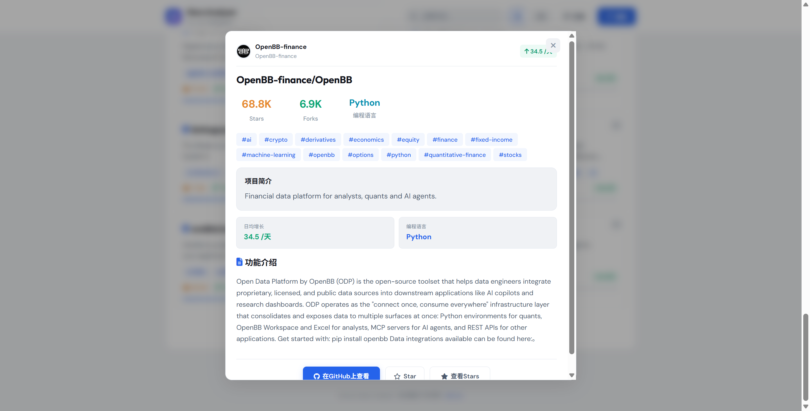

<div align="center">

# GitHub Stars Analyzer ⭐

**Smart discovery of the most noteworthy GitHub projects — AI, CS, LLM & Developer Tools**

[]()
[]()
[]()
[]()

[English](#english) · [中文](#chinese)

</div>

---

<a name="english"></a>
# 🇬🇧 English

> Tired of missing great GitHub projects? GitHub Stars Analyzer automatically crawls, categorizes, and ranks trending repositories so you never miss a gem.

## Features

- **Multi-dimension browsing** — AI Agent, Computer Science, LLM, Developer Tools, Rising Stars (fast-growing low-star projects)
- **Trend scoring** — Composite score / Fastest growing / All-time stars — three ranking dimensions
- **Language filtering** — Browse by programming language groups (Python, JS/TS, Go/Rust, etc.)
- **Project detail modal** — Auto-fetches README and extracts key features
- **GitHub OAuth login** — Star/unstar repos directly from the web UI
- **Bilingual UI** — One-click switch between Chinese and English
- **Auto data refresh** — Background scheduled fetching, no manual intervention needed

## Quick Start

### Prerequisites

- Python 3.10+
- A GitHub Token (recommended)
- A GitHub OAuth App (optional, only needed for Star button)

### Installation

```bash
# 1. Clone the repo
git clone https://github.com/oo-20/Github-Stars-Analyzer.git
cd Github-Stars-Analyzer

# 2. Install dependencies
pip install -r src/requirements.txt

# 3. Configure environment
cp .env.example .env
# Edit .env with your GITHUB_TOKEN (optional) and OAuth config (optional)

# 4. Start
python src/app.py
```

Open `http://localhost:5000` to use the app.

### Docker

```bash
cp .env.example .env
# Edit .env with your configuration

docker compose up -d
```

> **Note:** On first launch, the app will automatically fetch data in the background — this may take a few minutes. You can browse the cached results while it fetches.

## Configuration

### GitHub Token

1. Visit https://github.com/settings/tokens
2. Click **Generate new token (classic)**
3. No scopes needed (public repos only)
4. Copy the token into `.env` as `GITHUB_TOKEN`

The app works without a token but is limited to 60 API requests/hour (5000/hr with a token).

### GitHub OAuth

Required for the in-browser Star button:

1. Visit https://github.com/settings/developers → **OAuth Apps** → **New OAuth App**
2. Fill in:
   - **Application name**: GitHub Stars Analyzer
   - **Homepage URL**: `http://localhost:5000`
   - **Authorization callback URL**: `http://localhost:5000/api/github/callback`
3. Copy **Client ID** and **Client Secret** to `.env`

## Project Structure

```
github-stars-analyzer/
├── src/                   # Source code
│   ├── app.py             # Flask backend + API routes
│   ├── github_fetcher.py  # GitHub API crawler
│   ├── analyzer.py        # Trend analysis & categorization engine
│   ├── templates/
│   │   └── index.html     # Frontend (vanilla JS SPA)
│   └── requirements.txt   # Python dependencies
├── cached_data.json       # Local data cache (auto-generated)
├── Dockerfile             # Docker build
├── docker-compose.yml     # Docker orchestration
├── .env.example           # Config template
├── screenshots/           # Screenshots
├── LICENSE                # MIT License
└── README.md
```

## Tech Stack

| Layer | Technology |
|-------|-----------|
| Backend | Python 3, Flask, Flask-CORS |
| Frontend | Vanilla JavaScript (zero framework), CSS Variables |
| Data | REST API, JSON file cache |
| Tools | Docker, docker-compose |

## Screenshots




## License

MIT

---

<a name="chinese"></a>
# 🇨🇳 中文

> 如果你还在为总是错过 GitHub 上的优质项目而苦恼，不妨试试 GitHub Stars Analyzer！它自动爬取、分类、排名 GitHub 上的热门仓库，让你不再错过好项目。

## 功能

- **多维度分类浏览** — AI Agent、计算机科学、大语言模型、开发者工具、潜力新星（近期快速增长的冷门项目）
- **综合趋势评分** — 综合评分 / 快速增长 / 历史高星 三个排行维度
- **编程语言筛选** — 按语言分组浏览（Python、JS/TS、Go/Rust 等）
- **项目详情弹窗** — 自动抓取 README 并提取核心功能介绍
- **GitHub OAuth 登录** — 登录后可直接在网页端 Star 仓库
- **中英文双语** — 一键切换界面语言
- **自动数据更新** — 后台定时抓取 GitHub 数据，无需手动干预

## 快速开始

### 前置条件

- Python 3.10+
- 一个 GitHub Token（推荐）
- 一个 GitHub OAuth App（可选，仅 Star 功能需要）

### 安装

```bash
# 1. 克隆仓库
git clone https://github.com/oo-20/Github-Stars-Analyzer.git
cd Github-Stars-Analyzer

# 2. 安装依赖
pip install -r src/requirements.txt

# 3. 配置环境变量
cp .env.example .env
# 编辑 .env，填入你的 GITHUB_TOKEN（可选）和 OAuth 配置（可选）

# 4. 启动
python src/app.py
```

打开 `http://localhost:5000` 即可使用。

### Docker 运行

```bash
cp .env.example .env
# 编辑 .env 填入配置

docker compose up -d
```

> **注意：** 首次启动时，应用会自动在后台抓取数据，可能需要几分钟。你可以继续浏览已有缓存，不受影响。

## 配置说明

### GitHub Token

1. 访问 https://github.com/settings/tokens
2. 点击 **Generate new token (classic)**
3. 无需勾选任何权限（public repos only）
4. 复制 token 填入 `.env` 的 `GITHUB_TOKEN`

没有 Token 也能用，但 GitHub API 有每小时 60 次的频率限制（有 Token 提升到 5000 次）。

### GitHub OAuth

用于在网页端登录后直接 Star 仓库：

1. 访问 https://github.com/settings/developers → **OAuth Apps** → **New OAuth App**
2. 填写：
   - **Application name**: GitHub Stars Analyzer
   - **Homepage URL**: `http://localhost:5000`
   - **Authorization callback URL**: `http://localhost:5000/api/github/callback`
3. 创建后复制 **Client ID** 和 **Client Secret** 到 `.env`

## 项目结构

```
github-stars-analyzer/
├── src/                   # 主要源代码
│   ├── app.py             # Flask 后端 + API 路由
│   ├── github_fetcher.py  # GitHub API 爬虫
│   ├── analyzer.py        # 趋势分析和分类引擎
│   ├── templates/
│   │   └── index.html     # 前端页面（纯 JS 单页应用）
│   └── requirements.txt   # Python 依赖
├── cached_data.json       # 本地数据缓存（自动生成）
├── Dockerfile             # Docker 构建
├── docker-compose.yml     # Docker 编排
├── .env.example           # 配置模板
├── screenshots/           # 截图
├── LICENSE                # MIT 许可证
└── README.md
```

## 技术栈

| 层 | 技术 |
|----|------|
| 后端 | Python 3, Flask, Flask-CORS |
| 前端 | 纯 JavaScript（零框架）、CSS 变量 |
| 数据 | REST API、文件缓存（JSON） |
| 工具 | Docker, docker-compose |

## 截图


## License

MIT
