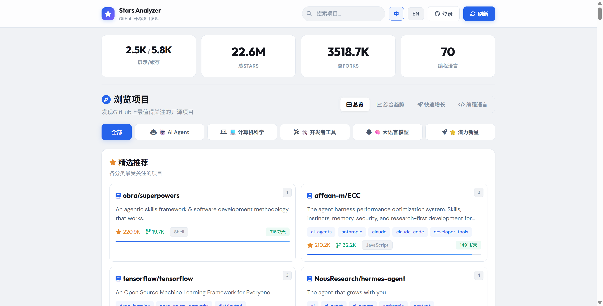

# GitHub Stars Analyzer ⭐

> 如果你还在为总是错过github上的优质项目而苦恼，不妨试试GitHub Stars Analyzer!

> 智能发现 GitHub 上最值得关注的AI,计算机相关项目。


## 功能

- **多维度分类浏览** — AI Agent、计算机科学、大语言模型、开发者工具、潜力新星（近期stars较高的项目）
- **综合趋势评分** — 综合评分 / 快速增长 / 历史高星 三个排行维度
- **编程语言筛选** — 按语言分组浏览（Python、JS/TS、Go/Rust 等）
- **项目详情弹窗** — 自动抓取 README 并提取核心功能介绍
- **GitHub OAuth 登录** — 登录后可直接 Star 仓库
- **中英文双语** — 一键切换界面语言
- **自动数据更新** — 后台定时抓取 GitHub 数据，无需手动干预

## 注意
如果想节省时间可以在使用之前刷新爬取最新的项目，第一次打开时需要花费一定时间爬取。（如果已经有了数据再次刷新时不影响使用）

## 截图



## 快速开始

### 前置条件

- Python 3.10+
- 一个 GitHub Token
- 一个 GitHub OAuth App（可选，仅 Star 功能需要）


### 安装

```bash
# 1. 克隆仓库
git clone https://github.com/yourname/github-stars-analyzer.git
cd github-stars-analyzer

# 2. 安装依赖
pip install -r src/requirements.txt

# 3. 配置环境变量
cp .env.example .env
# 编辑 .env，填入你的 GITHUB_TOKEN（可选）和 OAuth 配置（可选）

# 4. 启动
python src/app.py
```

打开 `http://localhost:5000` 即可使用。

### Docker 运行

```bash
# 复制环境变量
cp .env.example .env
# 编辑 .env 填入配置

# 启动
docker compose up -d
```

## 配置说明

### GitHub Token

1. 访问 https://github.com/settings/tokens
2. 点击 **Generate new token (classic)**
3. 无需勾选任何权限（public repos only）
4. 复制 token 填入 `.env` 的 `GITHUB_TOKEN`

没有 Token 也能用，但 GitHub API 有每小时 60 次的频率限制（有 Token 提升到 5000 次，如果没有会极大影响刷新项目）。

### GitHub OAuth

用于在网页端登录后直接 Star 仓库：

1. 访问 https://github.com/settings/developers → **OAuth Apps** → **New OAuth App**
2. 填写：
   - **Application name**: GitHub Stars Analyzer
   - **Homepage URL**: `http://localhost:5000`
   - **Authorization callback URL**: `http://localhost:5000/api/github/callback`
3. 创建后复制 **Client ID** 和 **Client Secret** 到 `.env`

## 项目结构

```
github-stars-analyzer/
├── src/                   # 主要源代码
│   ├── app.py             # Flask 后端 + API 路由
│   ├── github_fetcher.py  # GitHub API 爬虫
│   ├── analyzer.py        # 趋势分析和分类引擎
│   ├── templates/
│   │   └── index.html     # 前端页面（纯 JS 单页应用）
│   └── requirements.txt   # Python 依赖
├── cached_data.json       # 本地数据缓存
├── Dockerfile             # Docker 构建
├── docker-compose.yml     # Docker 编排
├── .env.example           # 配置模板
├── screenshots/           # 截图
├── LICENSE                # MIT 许可证
└── README.md
```

## 技术栈

| 层 | 技术 |
|----|------|
| 后端 | Python 3, Flask, Flask-CORS |
| 前端 | 纯 JavaScript（零框架）、CSS 变量 |
| 数据 | REST API、文件缓存（JSON） |
| 工具 | Docker, docker-compose |

## License

MIT
